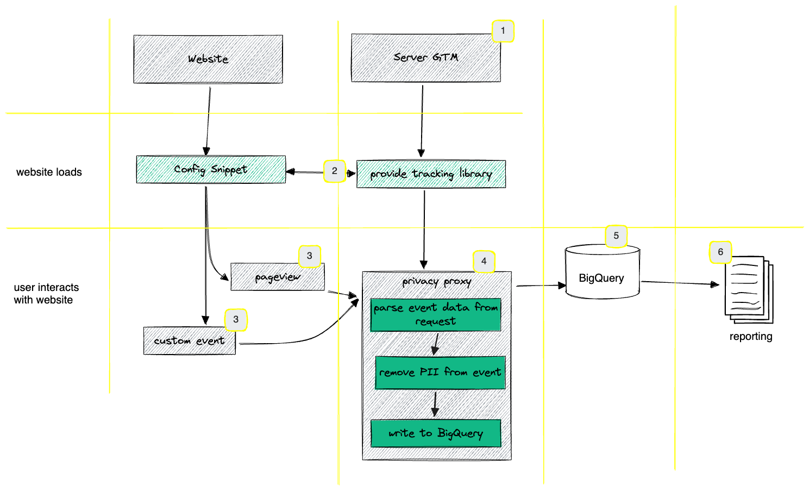

# Better than No Tracking

This repo contains a server GTM client that will serve the tracking library (number 2 in image below) and also process incoming requests (#4) and make them available to tags (#5).

# Idea

Many of the use-cases that today's analytics tools are solving can also be solved while completely refraining from the collection of all personal data. That way, it will still be possible to collect all interaction events and draw conclusions on the aggregate behaviour of a website's users.

We will be able to answer questions like
How many pageviews did I have on my new product detail page in the last 7 days?
How many transactions did I have in the last 30 days and how much revenue?
How many users clicked the accept/reject button on our cookie banner

However, we will not be able to answer questions like:
What was the landing page of a user that bought a product?
How many pages do my users open on average?
On what pages do users typically bounce?



Centre piece of this anonymous tracking setup will be a server GTM container (1). The server GTM will be running in a fully-controlled (cloud) environment. Typically, this will be Google Cloud Run. However, all other Docker-compatible computing services will work as well.

The server GTM will provide a small JavaScript library to the frontend of your website on page load (2). This JavaScript library will then take care of sending interaction data back to the server GTM on specific interaction events of the user (3).
The first thing that the server GTM will do on reception of such an interaction event will be to check it for suspicious PII (e. g. email-addresses, names, addresses, etc) and remove them from the incoming data. After the removal of this information, the server GTM will store the event data in BigQuery (5) or any other database solution (Google Analytics is also possible). After this storage, you are free to use the data in any reporting tool that you like (e. g. Looker Studio).


## Web Implementation

### Initial Setup Snippet

The following snippet will download the anonymous tracking library from your tracking server. You need to implement it on every page of your website and run it as early as possible after the page loaded. Running the snippet will not lead to any data being stored anywhere. It will only download the anonymous-tracking library from your server GTM.

The variable {{server-gtm-url}} at the end of the snippet will need to be replaced with your own server GTM URL.

The snippet will create a function called `btnt`. Calling this function will trigger a network request to your server GTM.

#### Config Snippet
Before calling the `btnt` function you will need to load the library with the below script. You can configure the following things
- `domain`: this is the domain from which your library will be loaded and to which your requests will be sent. This is REQUIRED
- `withCookies`: in case you want to avoid sharing cookies with the receiving domain (for security/privacy reasons), you can disbale this here. Default is `true`. Note that disabling cookies will mean your requests won't show up in the server GTM preview
- `maxBatchSize`: if you want to batch multiple events into one reuqests instead of sending one request for each event, you can configure any integer as `maxBatchSize` here. By default, this is off and events won't be batched

```html
<script>
  // this snippet is required to be run on every new pageload
  (function (t, r, kk, n, pp) {
    if (typeof window.btntConfig !== "object") {
      window.btntConfig = {
        domain: {{SERVER-GTM-URL}},
        withCookies: true,
        maxBatchSize: undefined // if you specify a number here, then a request will only be made for every 10th event or on page unload events
      };
    }
    if (window["btnt"]) return;
    window["btnt"] = function (z) {
      if (typeof z !== "object") {
        z = {};
      }
      if (typeof window.btntQueue !== "object") {
        window.btntQueue = [];
      }
      window.btntQueue.push(z);
    };
    n = t.createElement(r);
    pp = t.getElementsByTagName(r)[0];
    n.async = 1;
    n.src = window.btntConfig.domain + "/btnt.js";
    pp.parentNode.insertBefore(n, pp);
  })(document, "script", );
</script>
```

### Pageview

without any further configuration, the below command will send a `page_view` event with a couple of default parameters 

```html
<script>
  // by default, it will add the following parameters to the request unless you pass them into the function
  // page_referrer = document.referrer;
  // page_title = document.title;
  // page_location = document.location.href;
  // event_name = "page_view";
  // event_timestamp = Date.now();
  // z = Math.ceil(Math.random() * 100000000) <-- cache buster parameter
  // page_load_id = Math.ceil(Math.random() * 100000000) + Date.now(); <-- will only be generated once per page load

  window.btnt();
</script>
```

### Custom Event
To send a custom event, you can add an object with custom parameters. Passing any of the default parameter into the function object, will override the default values

```html
<script>
  window.btnt({ event_name: "purchase", event_value: 100 });
</script>
```

## Data Storage
Using the `bigQuerySchema.json` file in this repository, you can create a BigQuery table that would be able to store the event data. The table will have the following columns:

| Name | Description | Example | Event |
| ----- | ----- | ----- | :---: |
| page_location | the URL the user is on | https://www.example.com | all |
| page_title | the title of the page the user is on | Title of the Page | all |
| page_referrer | the page the user has been on before | https://www.google.de | all |
| event_name | The name of the interaction tracked | page\_view, consent_choice, transaction | all |
| new_session | Indicator if a hit has triggered a new session or not. Checks if the domain of the page\_referrer and the domain of the page_location are identical | true / false | pageview |
| traffic_source | The most recent domain that the user came from | google.com, facebook.com | on pageview event where new_session=true |
| traffic_medium | The most recent way through which the user came to our page | cpc, organic, social, referral, direct | on first pageview |
| event_timestamp | UNIX timestamp of the interaction |  | all |
| event_value | The value associated with the interaction | Transaction revenue | custom |
| custom_parameters | an array of {name: param_name, value: param_value} objects | custom | custom |
| custom_metrics | an array of {name: metric, value: metric_value} objects | custom | custom |


## Tests
### tests for server GTM template
The `TESTS.yml` file is automatically generated by the tests structured in this Google Sheet: https://docs.google.com/spreadsheets/d/1t7xVpxXkzhdHWyHFPF-1kAuQFl6t4VEdue0SV0cSmTU/edit#gid=0

### tests for frontend library `btnt.js`
```bash
$ npm install
$ npm run test
```